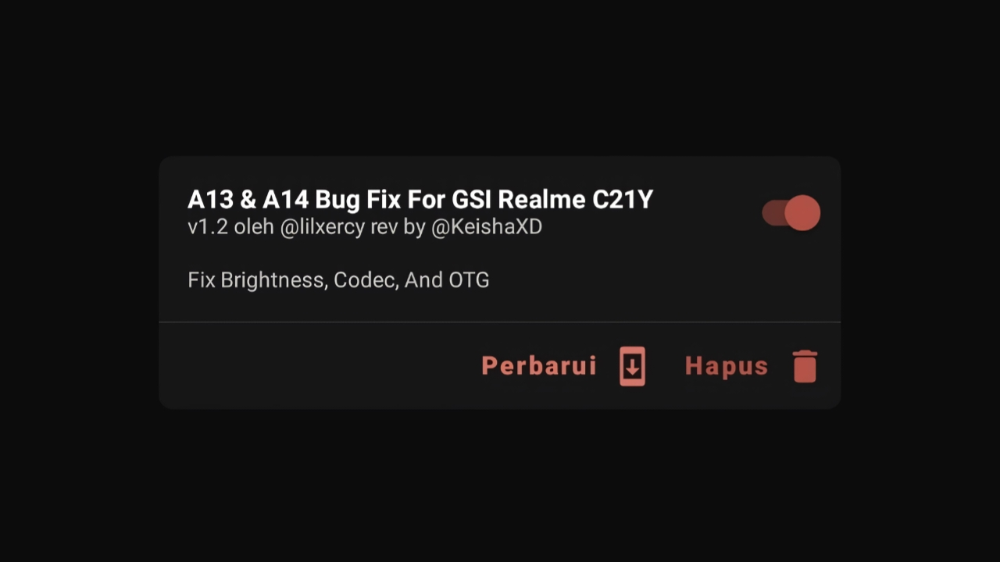

# Bug Fix for Realme C21Y

This module provides fixes for common issues found on Android 11 & Android 12 GSI Rom on the Realme C21Y device, specifically related to brightness and OTG functionality.

## Fixes :

1. **Brightness Issue**
   - Fixed issues with screen brightness not functioning properly or being unresponsive.

2. **OTG Issue**
   - Fixed issue with OTG detection and functionality.
   
3. **Video Codec Issue**
   - Fixed issue when playing a video [works, but it also depends on the gsi you use]

## Download :
To download this module, please go to the [Release page](https://github.com/KeishaXD/A13-14-Bug-Fix-Realme-C21Y/releases/latest)

## Disclaimer:
Do not use this module if you are using GSI A11 or A12. This module causes lag when playing videos (If installed on GSI A11 or A12).